  

## Intro:

Esse documento foi escrito na intenção de dar um norte a pessoas **iniciantes** no linux.  
Nesse texto você verá conceitos básicos mas essenciais para entender como utilizamos ambientes linux.  
Por hora o texto incluí os seguintes tópicos:

- [O que é Linux?](#oqelinux)
  - [Kernel?](#kernel)
  - [Estrutura de diretórios do Linux](#estruturadirlinux)
  - [É tudo no terminal?](#etudonoterminal)
- [Usuários, Grupos e Permissões](#usuariosgrupospermissoes)
  - [Modificando permissões e grupos](#modificandopermissoesegrupos)
  - [chmod](#chmod)
  - [chown](#chown)
- [Instalando/Atualizando programas](#instalandoatualizando)

_**Sinta-se livre para contribuir com o readme**_

Antes do inicio leitura, um disclaimer é necessário:

- **É necessário ter interesse em aprender**
- **Decorar não adianta, ninguém se sustenta dessa forma**
- **Seja curioso**!
- **Não se compare aos outros, perceba a sua evolução**
- **Não é possível aprender tudo da noite pro dia**

# Bem vindo ao Linux 🐧

## <a name="oqelinux">O que é Linux?</a>

Linux se refere ao kernel (núcleo) de Sistema Operacional, criado por Linus Torvalds, em 1991.  
O termo Linux também é utilizado para se referenciar aos sistemas operacionais que fazem uso do kernel Linux, porém, deve-se lembrar que um **_Sistema Operacional Linux_** na verdade é uma distribuição Linux, composta de diversos outros softwares (Shell¹, Bootloader², etc) acompanhados do kernel Linux.

¹ _Shell - Em tradução literal significa casca, mas no Linux é conhecido como um interpretador de comandos, sendo o mais comum o Bash._  
² _Bootloader: Trata-se de um pequeno programa, como exemplo temos o grub2, que é um gerenciador de inicialização, responsável por carregar o sistema operacional na memória, processo conhecido como boot._ 

### <a name="kernel">Kernel?</a>
Software que controla como será usado o processador, a memória, o disco e periféricos.  
É o software presente em todo sistema operacional que determina como o computador deve funcionar.

## <a name="estruturadirlinux" id="estruturadirlinux">Estrutura de diretórios do Linux</a>

O Linux segue uma filosofia diferente da estrutura de arquivos, a primeira vista assusta pois em um ambiente Windows temos o diretório `C://` como pasta raiz do sistema e então as pastas do sistema são apresentadas de forma mais amigável, como `Usuários`, `Arquivos e Programas` e `Windows`.  
Então não é que o Linux é mais complexo, mas sim que o Windows esconde melhor as coisas de você 😙.

|Caminho|Descrição|
| ------------------- | ------------------- |
|`/ ` |  Diretório raiz.|
|`/bin`| Diretório onde estão os arquivos  executáveis e comandos essenciais do sistema.|
|`/boot` | Diretório onde estão os arquivos necessários para iniciar o sistema. Aqui é onde fica localizada a imagem do Kernel do Linux.|
|`/dev`| Diretório onde estão os arquivos de dispositivos do sistema, como discos, cd-roms, terminais etc.|
|`/etc`| Diretório onde estão localizados os arquivos de configuração do sistema.|
|`/home`| Diretório que geralmente é usado  pelos usuários.|
|`~`|Diretório da pasta pessoal do usuário, um alias  para `/home/<usuario>`|
|`/lib`| Diretório onde estão localizadas as bibliotecas essenciais ao sistema, utilizadas pelos programas em /bin e módulos do Kernel.|
|`/mnt`| Diretório vazio. Este diretório geralmente é utilizado para pontos de montagem de dispositivos.|
|`/proc`| Diretório que possui informações do Kernel e de processos.|
|`/opt` | Diretório onde estão localizados os aplicativos instalados que não venham com o Linux.|
|`/root`| Diretório do superusuários(root). Em algumas distribuições ele pode ou não estar presente.|
|`/sbin` | Diretório onde estão os arquivos essenciais do sistema, como aplicativos, utilitários para administração do sistema. Normalmente só o superusuário(root) tem acesso aos arquivos.|
|`/tmp`| Diretório de arquivos temporários.|
|`/usr`| Diretório de arquivos pertencentes aos usuários e a segunda maior hierarquia de diretórios no Linux.|
|`/var`| Diretório onde são guardadas informações variáveis ao sistema, como arquivos de logs etc… `|

## <a name="etudonoterminal" id="etudonoterminal">É tudo no terminal?</a>

Sim e não, isso varia muito de qual distro você escolheu, mas num geral se você for um usuário que vai apenas abrir o navegador, calculadora e editores de texto, não vai ser necessário nenhum contato com o terminal, mas, qualquer coisa fora da utilização mínima do sistema já te coloca na mira do terminal.
Mas não entre em pânico, nos dias de hoje muita coisa é simplificada e 90% das coisas vão ser tipo:

>-- Hummm não sei como fazer isso no linux

E então você resolve assim:

>**faz pesquisa marota no google**  
>**acha um link do stackoverflow**   
>**copia um código de uma resposta**  
>~~busca entender aquilo que copiou antes de colar no terminal~~  
>**cola no terminal e executa** ~~com sudo~~

E então ✨ **works just like magic** ✨.

Vamos entender um pouco sobre o terminal  
Basta utilizar o atalho `CTRL + ALT + T` (No caso do Ubuntu) que o terminal iniciará:

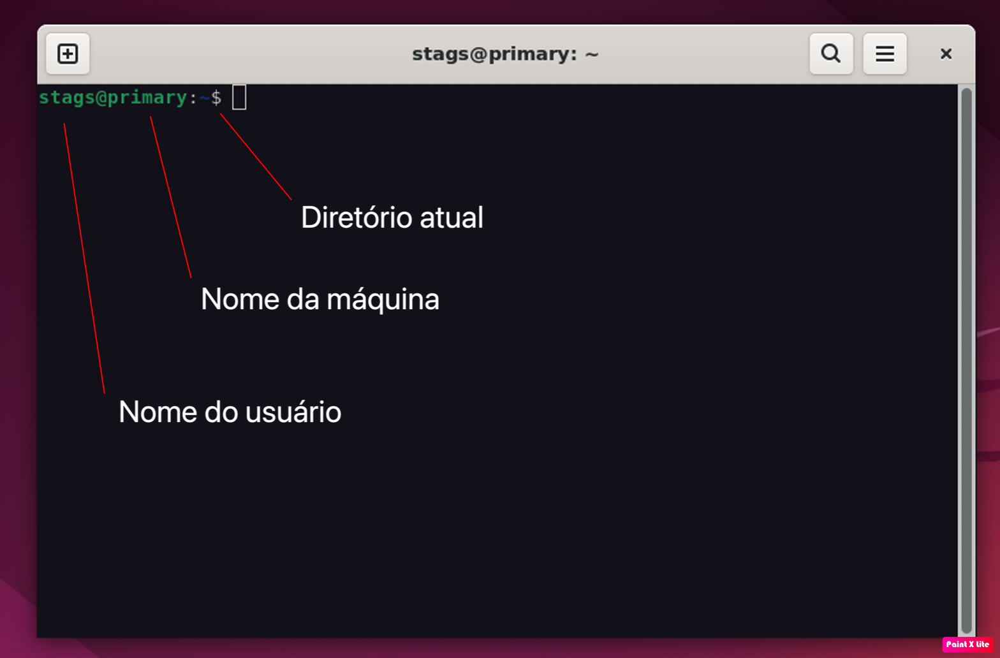

##### O que devemos ter em mente quando utilizamos o console:
- Para executar um comando no console, basta digitar o comando e pressionar a tecla `ENTER` do teclado
- Quando executamos um comando e nada é retornado, significa que ocorreu tudo bem
- Após executarmos um comando, o cursor é apresentado novamente, aguardando o próximo comando
- O Linux é case sensitive, ou seja, ele diferencia letras maiúsculas e minúsculas em comandos, nomes de arquivos e/ou pastas.
- Para sair do console execute o comando `exit`.
- É possível utilizar a seta pra cima do teclado `^` para recupearar comandos já executados

Fique frio, tudo começa pequeno e vai ganhando forma com o tempo, vamos começar com os comandos básicos do sistema:

| Comando  |  Descrição  |
| ------------------- | ------------------- |
|`man`| Manual do sistema|
|`pwd`| Printa o nome do diretório atual|
|`ls`| Lista todos os arquivos do diretório|
|`cd`| Acessa uma determinada pasta (diretório)|
|`mkdir`| Cria um diretório|
|`df`| Mostra a quantidade de espaço usada no disco rígido|
|`free`|Mostra a quantidade de espaço usada em memória RAM|
|`top`| Mostra os processos rodando|
|`rm`| Remove um arquivo/diretório|
|`cat`| Exibe arquivos|
|`vi`/`nano`/`vim`| Abre o editor de texto no terminal para editar/criar arquivos|
|`cal`| Exibe o calendário do sistema|
|`history`| Exibe o histórico de comandos executados|

[Veja mais comandos aqui](https://www.devmedia.com.br/comandos-importantes-linux/23893)

É interessante observar que quase todos os comandos linux podem receber `flags` de opções e/ou aceitam `parâmetros`.

Um exemplo bem simples de se compreender:  
O comando `man` aceita um parametro `name`
> stags@primary:~$ `man` `name`

no lugar de name passaremos o nome do comando que queremos ver no manual, como por exemplo: `cat`

>stags@primary:~$ `man cat`

o modo leitura do terminal começa:

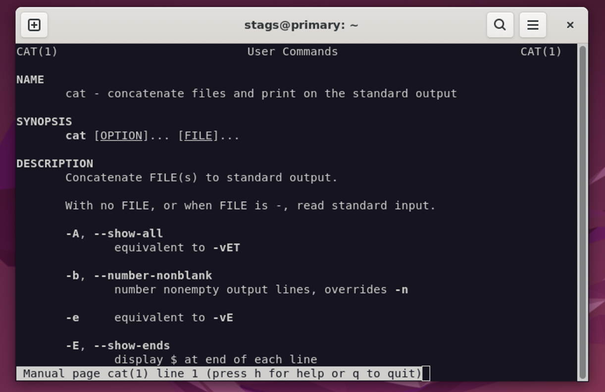

Consegue perceber? executamos o **comando** `man` passando `cat` como **parametro**.

Ok... mas e as `flags`?  
Bom, as flags seriam as opções para que o terminal execute o comando com mudanças no `output`, por exemplo, a `flag` `-f` do **comando**  `man` fará com que o terminal retorne apenas uma descrição do comando, ao invés de todo o manual em modo de leitura:

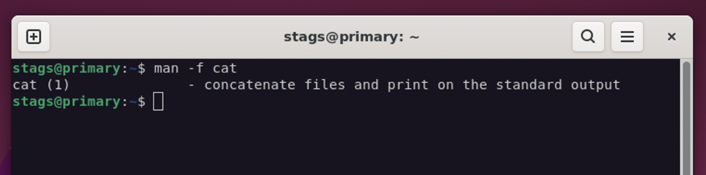

Perceba como fica a sintaxe:

>stags@primary:~$ `comando [...FLAGS] [...PARAMETROS]`

O terminal aceita caracteres especiais que acabam facilitando a nossa vida, um bom exemplo é a barra invertida `\`, que acompanhada da tecla `Enter`, resultara em uma quebra de linha no terminal, apenas.

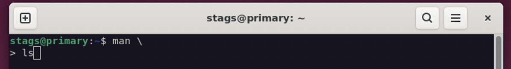

Também tem a barra vertical (pipe) `|`.  
Que passa o retorno de um comando, como parametro para o próximo argumento.  
Um exemplo seria utilizando o **comando** `ls` para listar o diretório + o **comando** `wc` para contar as linhas de um output:

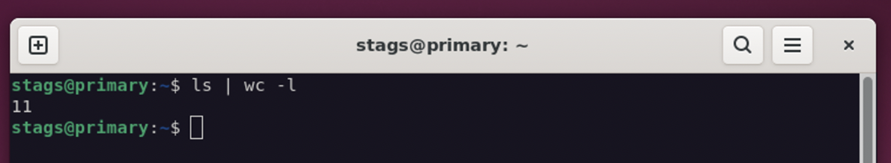

Assim conseguiremos contar quantos itens (arquivos/pastas) temos no diretório aonde o ls foi executado.  
Podemos imaginar algo como:
> stags@primary:~$ `ls | wc -l [RESULTADO DO COMANDO ANTERIOR]`

E assim podemos encadear comandos infinitamente.

## <a name="usuariosgrupospermissoes" id="usuariosgrupospermissoes"> Usuários, Grupos e Permissões</a>
Uma das coisas que torna o Sistema Operacional Linux seguro, é a  exigência de que arquivo no sistema tenha dono e permissões de uso.  
Então acaba sendo comum você tentar acessar/criar/modificar algo e o linux te responder:

> Você não tem permissão.

Talvez você fique meio chateado, por que afinal, você é o único usuário daquele computador, e as vezes até mesmo o dono do computador e derrepente você não tem permissão pra mexer no seus próprios arquivos? E quem é que tem então?  

É importante entender que em um ambiente Linux existem 3 tipos de usuários, o de sistema, o ROOT e o comum.

Um usuário ROOT é o usuário com permissão total de utilização do sistema. Esse usuário pode criar pastas/arquivos em qualquer diretório, além de poder editar e excluir qualquer arquivo de qualquer usuário.  
Esse usuário pode executar, também, qualquer comando disponível no sistema operacional.

Um usuário comum é o usuário que instalou o Linux na máquina e qualquer outro usuário criado posteriormente para utilizar o PC.  
 Esse tipo de usuário tem algumas restrições na utilização do sistema, ou seja, não podem executar todos os comandos e configurações disponíveis, entretanto, o usuário que instalou o sistema na máquina tem permissões de executar todos os comandos de um ROOT, bastando adicionar o comando SUDO antes do comando desejado.

Um usuário de sistema é um usuário fictício que é criado durante a instalação de algum programa para executar tarefas específicas daquele programa. Não é possível logar no sistema utilizando um usuário de sistema, ele somente existe para controle de alguns softwares adicionais que instalamos ou que vêm instalados por padrão no Linux.  

Todos os usuários conseguem listar o conteúdos dos diretórios, mas somente o usuário ROOT pode criar arquivos e/ou pastas em um diretório diferente de seu diretório pessoal. Isso quer dizer que, seu eu quiser logar no sistema com um usuário comum, somente poderei criar arquivos e/ou pastas em meu diretório pessoal, ou seja, o diretório `/home/usuário`.  
Entretanto, o Linux permite que o usuário que instalou o sistema na máquina execute comandos como ROOT, como criar pastas ou arquivos em diretórios diferentes de sua pasta pessoal.
Para executar um comando como ROOT, basta digitar o comando `sudo` antes do comando que queremos executar como ROOT, vamos a um exemplo:

Criando uma pasta em um diretório diferente do diretório pessoal:
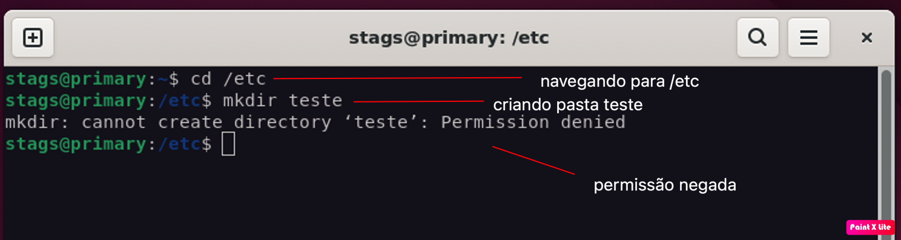

Para resolvermos isso, basta então executar o mesmo comando mas com `sudo` antes de qualquer coisa:

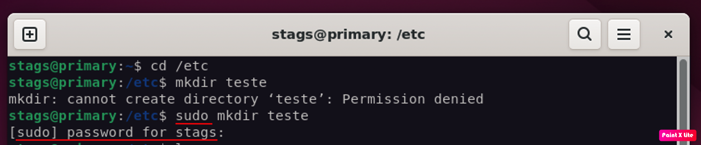

O console solicita a sua senha e ✨ *como mágica* ✨  é criado uma nova pasta teste.

Mas peraí...

Quer dizer que qualquer é só eu ter um usuário, digitar a senha do usuário e posso fazer tudo? Afinal, e a questão da segurança?

Esse é um ponto importante.  
O que acontece, na realidade, é que o usuário que instalou o sistema operacional na máquina tem direitos de executar comandos como administrador, pois, teoricamente ele é responsável pela máquina, concorda? Por isso, ele pode executar comandos com o `sudo`.  
Se você posteriormente pensar em criar um novo usuário no PC, vai perceber que ele não vai conseguir executar comandos com `sudo` (a não ser que você configure o novo usuário para isso 😙)

Começaremos primeiro entendendo as permissões de arquivos/diretórios

Iremos para `~/` e então executamos `ls`, que nos retornará os arquivos/pastas daquele diretório, repare que após `ls` utilizamos a `flag` `-l`, que serivirá para mostrar informações extras.

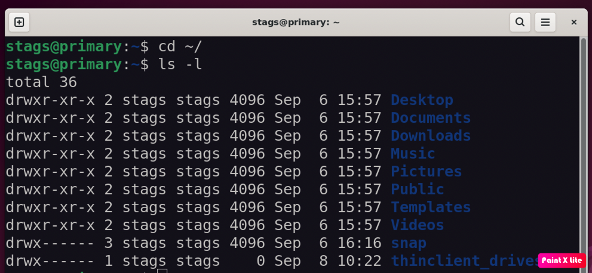

A primeira vista fica difícil entender né?  
Vamos dissecar esse print:  

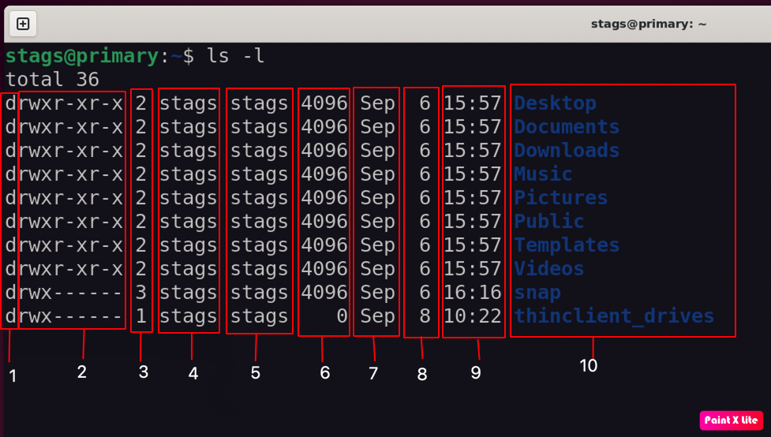

1 - Tipo do item listado. Os mais comuns são `l`, `d` ou `-`
-  `l` Um tipo especial chamado [*symlink*](https://medium.com/@dbacon338/what-is-the-difference-between-a-hard-link-and-a-symbolic-link-6f1e56a2317b#.vf838n1qa) 
-  `d` Um diretório
-  `-` Um arquivo normal 
-  `b` Arquivo de bloco
-  `c` Arquivo especial de caractere
-  `p` Canal
-  `s` Socket

2 - Conhecido como conjunto de 3 caracteres, na sequência, indica as permissões de `leitura`, `gravação` e `execução`, para `owner`, `group` e `demais usuários`. (*Todo arquivo/diretório possui um `group` e um `owner`*)  
A cada 3 caracteres, forma-se um conjunto de permissões:
 Os três primeiros dizem respeito ao `owner` (o dono do arquivo ou diretório)
 Na sequência vem os que dizem respeito ao `group` ao qual o usuário pertence
 E por último, mas não menos importante, os 3 ultimos dizem respeito aos demais usuários

Vamos entender o que significa esses caracteres (r, w, x, -):  
 `r` - Leitura  

 `w` - Gravação  

 `x` - Execução  

 `-` - Permissão desabilitada  

Dito isso, podemos dizer que o diretório `Desktop` por exemplo, possui as seguintes permissões:

>`owner` - `Leitura, gravação e execução`  
>
>`group` -  `Leitura e execução`  
>
>`demais usuários` - `Leitura e execução`  

É possível alterar as permissões utilizando o comando `chmod`.   
Também é possível alterar o dono e o grupo utilizando o comando `chown`.

3 - Contagem de links

4 - `owner` do item

5 - `group` do item

6 - Tamanho do item em bytes

7 - Mês de criação/modificação do item

8 - Dia de criação/modificação do item

9 - Hora de criação/modificação do item

10 - Nome do item

## <a name="modificandopermissoesegrupos" id="modificandopermissoesegrupos">Modificando permissões e grupos</a>
Como citado anteriormente podemos modificar permissões/grupos com `chmod`/`chown`.  
🚨  Devemos ter **muito** cuidado ao utilizar, já que o uso errado desses comandos podem acabar liberando acesso para modificações em qualquer item/diretório do sistema para qualquer usuário, ou então bloqueando acesso a um recurso da maquina que precisa ser consumido por uma outra aplicação.

#### <a name="chmod" id="chmod">chmod</a>
A sintaxe para o comando é a seguinte:
> stags@primary:~$ `chmod [PERMISSÕES] [...ARQUIVOS]`

Ao analizarmos as permissões de um diretório nos exemplos acima, vimos os `conjuntos de permissões` que eram composto por caracteres, e representavam permissões.  
Saiba que podemos também expressar essas permissões em números, compare com a tabela a seguir:

|Permissão|Numero|Caracter|
|--------|-------|-------|
|`Nenhuma permissão`|`0`|`-`|
|`Apenas executar`|`1`|`- - x`|
|`Apenas gravar`|`2`|`- w -`|
|`Gravar e executar`|`3`|`- w x`|
|`Apenas ler`|`4`|`r - -`|
|`Apenas ler e executar`|`5`|`r - x`|
|`Apenas ler e gravar`|`6`|`r w -`|
|`Todas as permissões`|`7`|`r w x`|

_**Não se esqueça que para qualquer arquivo/pasta temos sempre 3 entidades**_  
_**`owner`, `group` e `demais usuários`**_

Então como descreveriamos tanto em numeros como caracteres que um arquivo possúi as seguinte caracteristicas?

- O `owner` pode ler, escrever e executar
- O `group` pode ler e executar
- `Demais usuários` não podem fazer nada

Em  números ficaria `750`, em caracteres seria `rwxr-x---`  

Vamos para um exemplo:

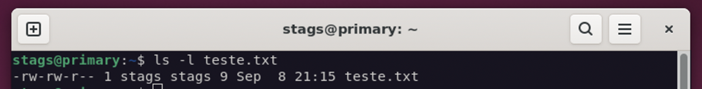

Ao verificar as permissões de `teste.txt` vemos que possuímos a seguinte configuração:  
`rw-rw-r--`, que traduzindo seria:  
- O `owner` pode ler e escrever
- O `group` pode ler e escrever
- `Demais usuário` podem apenas ler

e se quisessemos que `Demais usuários` **pudessem fazer tudo**?  

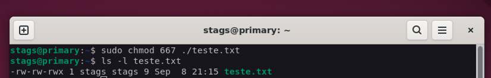

Ao verificar novamente as permissões de `teste.txt` vemos que possuímos a configuração `rw-rw-rwx`, que traduzindo seria:  
- O `owner` pode ler e escrever
- O `group` pode ler e escrever
- `Demais usuário` podem fazer tudo.

Quero que você perceba que tivemos que passar permissão para `owner` (6), `group`(6) e então `demais usuários` (7).  
Poderiamos também alterar diretamente as permissões **apenas** de `demais usuários` diretamente:

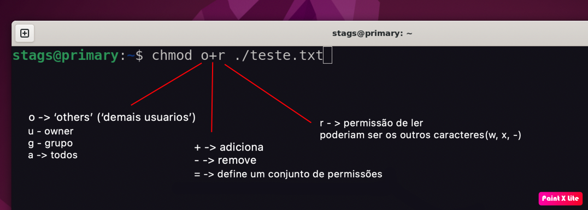

**_Dica: crie arquivos e diretórios. Em seguida, teste a combinação de permissões com chmod. Isso lhe ajudará muito no entendimento deste recurso._**

#### <a name="chown" id="chown">chown</a>
A sintaxe básica para o comando é a seguinte:
> stags@primary:~$ `chown [...FLAGS] owner:group [...ARQUIVOS]`

com esse comando, específicamos quem será o owner e quem será o grupo daquele arquivo/diretório.

Um exemplo:

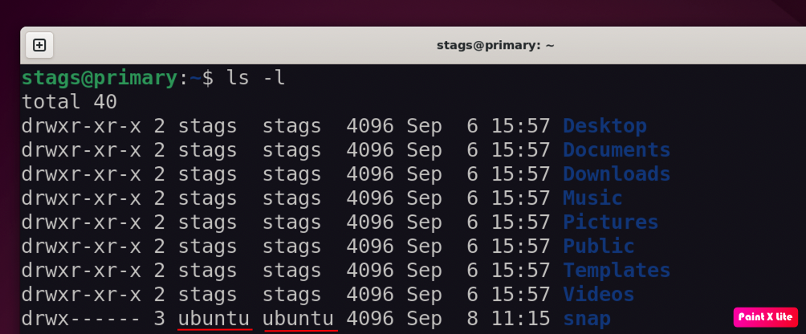

Com `ls -l` vemos que a pasta `snap` tem o `owner` como `ubuntu` e o group como `ubuntu`.    

Queremos então mudar o `owner` para stags, faremos isso com `chown stags:ubuntu ./snap`:

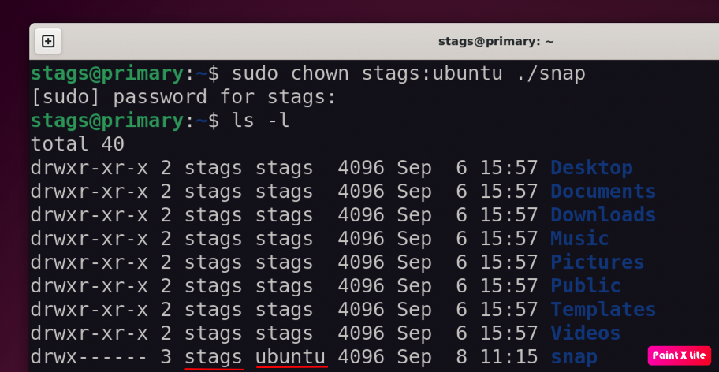

E com um outro `ls -l` vemos que agora o `owner` de `snap`é `stags`e não mais `ubuntu`.

## Instalando/Atualizando programas
## <a name="instalandoatualizando" id="instalandoatualizando">Instalando/Atualizando programas</a>

Antes de mais nada é preciso saber que temos opções para instalar programas via interface gráfica, mas como gostamos do terminal agora, iremos fazer tudo pelo terminal

Especificamente no Ubuntu (uma das centenas de distribuições linux) temos um comando chamdo `apt`.  
A definção para `apt`é : `Advanced Package Tool`, simplificando, uma ferramenta para adicionar/remover/atualizar pacotes (programas)

Dentro de um terminal podemos executar `sudo apt update`, para atualizar tudo que tiver disponivel para atualizar no sistema, ou então `sudo apt update <nome do pacote>` para atualizar algum pacote específico.
Alem de `update` podemos utilizar `install` para instalar algum pacote, ou então `remove` para remover algum pacote e `purge` para remover tudo, incluindo arquivos de configuração do pacote.

Ok... mas de onde vem os pacotes baixados?  
Aí é que mora a mágica, precisamos entender o conceito de **_Repositórios de pacotes_**.

Um repositório nada mais é que um servidor que contém um conjunto de software. O Ubuntu fornece um conjunto de repositórios para que você não precise procurar na internet pelo arquivo de instalação de vários softwares de sua necessidade. Essa forma centralizada de fornecer software é um dos principais pontos fortes do uso do Linux.  
O gerenciador de pacotes APT obtém as informações do repositório do arquivo /etc/apt/sources.list e arquivos listados no diretório /etc/apt/sources.list.d. As informações do repositório geralmente estão no seguinte formato:  

`deb http://us.archive.ubuntu.com/ubuntu/dists/bionic main`  

Você pode inclusive [acessar o repositório para ver como ele está estruturado](http://us.archive.ubuntu.com/)

Quando você atualiza o Ubuntu usando o comando `apt update`, o gerenciador de pacotes `apt` obtém as informações sobre os pacotes disponíveis (e suas informações de versão) dos repositórios e armazena-os no cache local.  
Você pode ver isso no diretório `/var/lib/apt/lists`.

Manter essas informações localmente acelera o processo de busca, porque você não precisa percorrer a rede e pesquisar no banco de dados de pacotes disponíveis apenas para verificar se um determinado pacote está disponível ou não.

Então é comum que antes de instalar um programa específico, por exemplo o docker, você tenha que instalar o repositório aonde o docker está, veja um exemplo da própria documentação do docker:
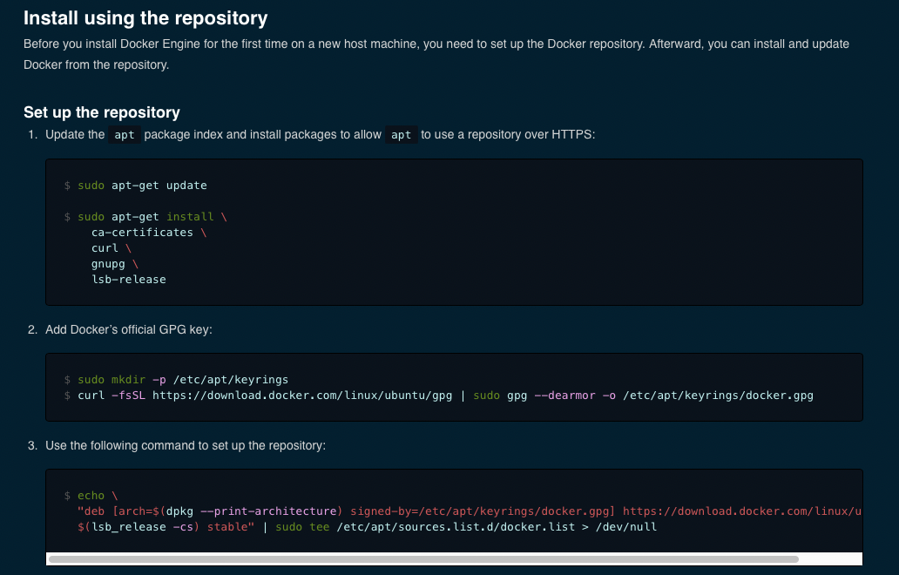

<h1>Mais sobre usuários e grupos

Em um servidor, é muito comum que vários funcionários tenham acesso ao mesmo, e com isso, precisamos de diferentes usuários com diferentes permissões. Mas como criamos um novo usuário utilizando linha de comando? Simples: utilizamos o comando `useradd` seguido do nome que desejamos dar ao usuário, por exemplo: `useradd Linus` , e assim temos um novo usuário registrado nessa máquina. 
Porém, devemos tomar nota de duas coisas:

​	1 - Esse usuário ainda não tem uma senha cadastrada

​	2 - Esse usuário não possui um _shell_ definido

Para definir a senha do usuário _Linus_ usamos o comando `passwd Linus` e o terminal irá pedir a senha que desejamos dar ao usuário. Simples, não?

Agora para que o usuário tenha acesso aos comandos que utilizamos e que esses comandos sejam devidamente interpretados pelo terminal, precisamos definir o Shell do usuário, para isso, o mais comum é utilizarmos o Bash, que é o Shell padrão do Linux ubuntu. Então, é extremamente necessário que executemos o comando `chsh -s /bin/bash Linus` para que nosso querido Linus consiga utilizar devidamente os comandos do Linux.

Além dos usuários, temos os grupos que já foram abordados antes, mas afinal o que são os grupos? 🤔 São basicamente conjuntos de usuários, podemos classificar os usuários em grupos por questões de segurança (permissões por grupo nos diretórios) ou por simples organização.

Para criarmos um grupo, podemos usar o comando `groupadd [nome do grupo]` , por exemplo, `groupadd desenvolvedores` dessa forma, criamos o grupo "desenvolvedores", e podemos conferir o grupo utilizando o comando `cat /etc/group`. Ah, também vale lembrar que um usuário pode participar de vários grupos ao mesmo tempo

Por padrão, os grupos que são criados manualmente, são criados vazios, sem nenhum usuário adicionado, então, se quisermos adicionar nosso querido Linus no grupo dos desenvolvedores, executamos a seguite linha de comando:

`useradd Linus -G desenvolvedores`

ou

`usermod -g desenvolvedores Linus`

É importante ressaltar que apenas o usuário root, ou usuários com acesso ao `sudo` (também chamados de sudoers) podem adicionar usuários aos grupos.

Ok, tudo tranquilo até aqui... mas vamos supor que o Linus tenha derrubado café no computador da empresa e foi demitido 😲, e agora, como excluímos o usuário dele da máquina em questão?

Para isso, utilizamos o comando `userdel -r Linus`, dessa forma, removemos o usuário da máquina e também o diretório home dele.

Agora,   vamos supor que o Linus não tenha derramado o café no PC, apenas tenha decidido mudar de setor e ir para a equipe de suporte, como tiramos ele do grupo desenvolvedores?

Bem, executando o comando `gpasswd -d Linus desenvolvedores` fazemos isso com facilidade, e agora o Linus não faz mais parte do grupo dos desenvolvedores.
